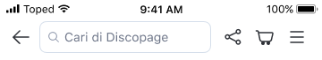
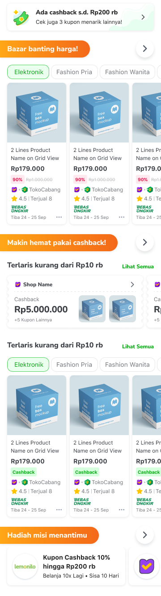
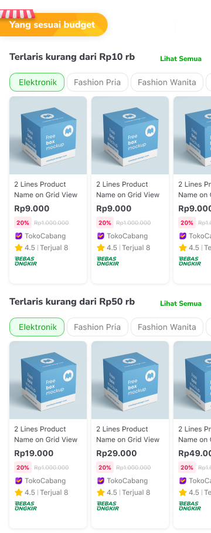
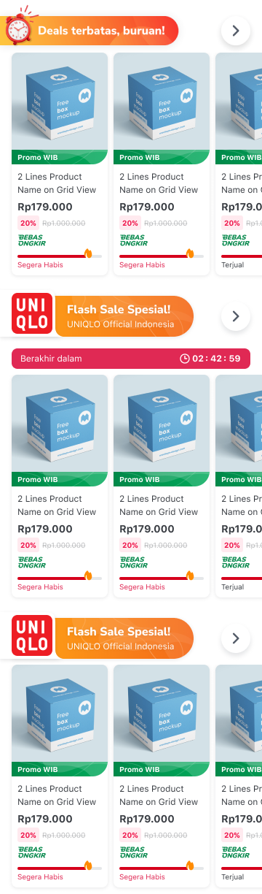
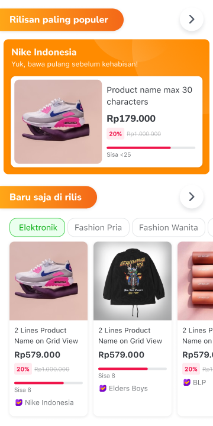
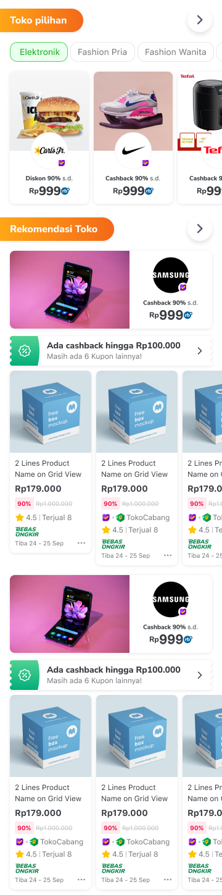
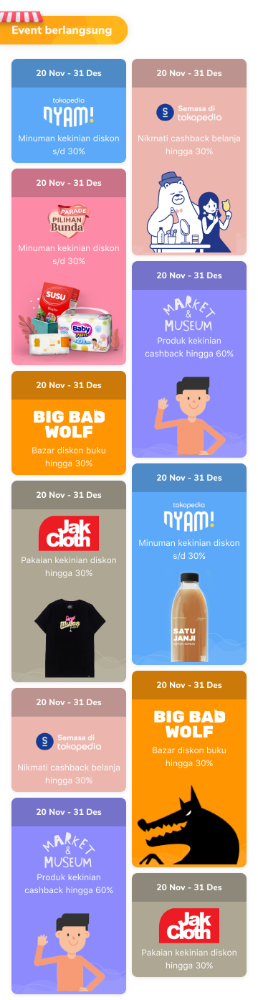

<html>
<head>
<meta name="viewport" content="width=device-width, initial-scale=1">

</head>
<body>

    

    

  <a class="nav-item active" id="anchor-1" href="#section-1">
    
    Promo Terbaik
  </a>
  <a class="nav-item" id="anchor-2" href="#section-2">
    
    Sesuai Budget
  </a>
  <a class="nav-item" id="anchor-3" href="#section-3">
    
    Flash Sale
  </a>
  <a class="nav-item" id="anchor-4" href="#section-4">
    
    Rilisan Spesial!
  </a>
  <a class="nav-item" id="anchor-5" href="#section-5">
    
    Toko Pilihan
  </a>
  <a class="nav-item" id="anchor-6" href="#section-6">
    
    Semua Event
  </a>

  

    
   

  

    
   

  

    
   

  

    
   

  

    
   

  

    
   

  

<!--  -->

</body>
</html>
